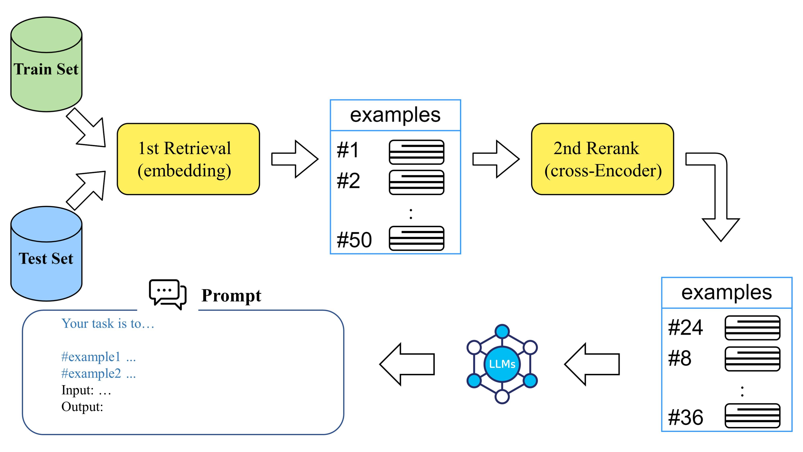
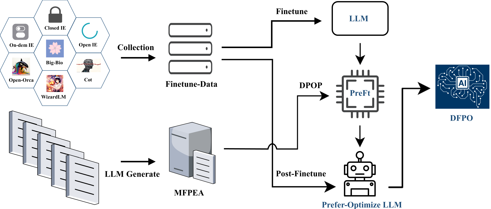
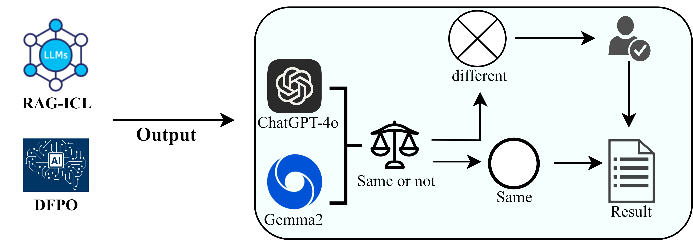

    <h1>RAG-ICL and DFPO: Enhancement methods for two learning paradigms in biomedical information extraction</h1>

    
    

    This repository provides code for the RAG-ICL and DFPO methods. RAG-ICL is based on the concept of Retrieval-Augmented Generation (RAG), optimizing in-context learning by selecting high-quality examples. <b>DFPO</b> (<b>D</b>ual-phase <b>F</b>ine-tuning and <b>P</b>reference <b>O</b>ptimization), on the other hand, uses a "two-stage fine-tuning and preference optimization" strategy, specifically designed for the data structure of biomedical information extraction tasks. It gradually strengthens the model's performance on positive samples and enhances overall effectiveness through preference optimization. Experimental results show that both methods achieve significant improvements over traditional approaches.
    <ul>
        <li>
            📖 Paper: <a href="">RAG-ICL and DFPO: Enhancement methods for two learning paradigms in biomedical information extraction</a>
        </li>
        <li>
            🤖 Model availiable: <a href="https://huggingface.co/Knifecat/DFPO-Gemma2">Knifecat/DFPO-Gemma2</a>
        </li>
        <li>
            📁 PreFt-Data and MFPEA: <a href="https://huggingface.co/Knifecat">Data</a>
        </li>
    </ul>

<h3>RAG-ICL Flowchart</h3>

    

<h3>DFPO Flowchart</h3>

    

<h3>DMCR Flowchart</h3>

    

<h2>Prerequisites</h2>
<ul>
    <li>Python 3.10 or higher</li>
    <li>PyTorch</li>
    <li>langchain</li>
    <li>transformers</li>
    <li>peft</li>
    <li>bitsandbytes</li>
    <li>accelerate</li>
    <li>deepspeed</li>
</ul>

Install the required packages using:
<pre><code>pip install -r requirements.txt</code></pre>

